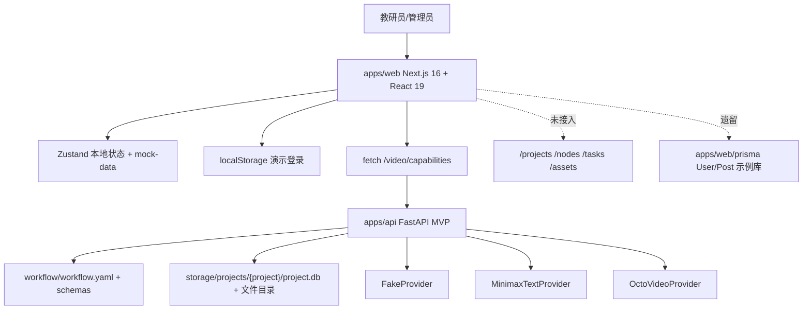
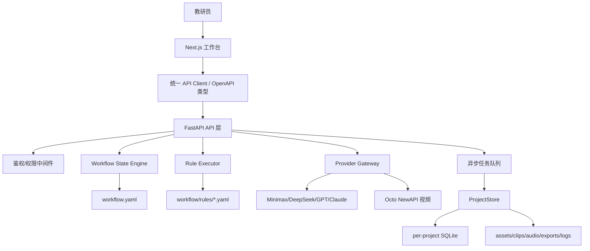

# ShanHaiEdu 全局架构评审交接文档

版本：2026-06-20 v1  
评审角色：首席系统架构师  
评审范围：`apps/web`、`apps/api`、`workflow`、`docs`、部署/配置/安全边界  
结论：当前项目已具备“规范层 + Web 演示端 + FastAPI 视频闭环 MVP”的雏形，但前端、后端、工作流真源、部署标准尚未完全收口。短期必须先修复双真源、鉴权/密钥边界、构建绕过、接口契约与异步任务持久化问题，再进入完整 PPT/视频主链路扩展。

## 1. 整体架构图说明

### 1.1 当前实态架构



节点说明：
- `apps/web` 是当前用户界面主入口，`apps/web/src/app/page.tsx` 渲染 `AppShell`。
- 前端业务主状态仍来自 `apps/web/src/lib/store.ts`、`apps/web/src/lib/mock-data.ts`，并使用硬编码演示登录。
- `apps/api` 是后端 MVP，已提供项目、上传、节点生成/编辑/确认、视频任务与素材查询接口。
- `workflow/workflow.yaml` 是目标流程真源，但后端 MVP 当前只使用 `MVP_NODE_IDS` 和 `MVP_DEPENDENCIES` 子集。
- `apps/web/prisma/schema.prisma` 仍是 `User/Post` 示例结构，与项目业务模型不匹配，不应作为当前业务数据真源。

### 1.2 目标收口架构



调用链路：
1. 用户在前端创建项目、上传教材、触发节点生成。
2. 前端只通过统一 API Client 调后端，不直接保存业务真数据。
3. 后端鉴权后读取 `workflow.yaml` 的 DAG、schema 和规则。
4. 节点生成统一经 Provider Gateway，输出先做 schema + 规则校验，再写入版本表。
5. 长任务进入异步队列，任务状态和 provider task id 持久化到项目 SQLite。
6. 前端通过轮询或 SSE 获取任务状态，用户确认后推进状态机。

依赖关系原则：
- UI 不直接访问密钥、视频 provider、SQLite 文件和本地任务目录。
- 业务代码不直接 import 具体外部 SDK；所有外部模型、视频、TTS 调用经 provider adapter。
- 工作流节点、状态、硬约束以 `workflow` 为配置真源，代码只实现执行器。

## 2. 模块分工与工程师职责边界

### 2.1 前端工程师

职责：
- 维护 `apps/web` 页面、组件、表单、状态视图与用户交互。
- 从 `workflow/schemas/*.json` 或后端 schema API 渲染字段表单。
- 使用统一 API Client 接入 `/projects`、`/nodes`、`/tasks`、`/assets`。
- 实现 loading、error、empty、retry、approve、redo、版本历史、任务进度状态。

边界：
- 不保存真实业务状态为 localStorage 或 mock 常量。
- 不接触 provider key、服务端 `.env`、SQLite 文件路径。
- 不在 UI 中实现硬约束最终判断，只做前置提示；最终 hard block 以后端为准。

### 2.2 后端工程师

职责：
- 维护 `apps/api` 的 FastAPI 接口、状态机、ProjectStore、Provider Gateway。
- 将 `workflow.yaml`、rules、schemas 纳入运行时真源。
- 提供鉴权、权限、输入校验、版本、任务、日志、错误打包能力。
- 对外部 provider 做重试、降级、超时、错误归一化和敏感信息脱敏。

边界：
- 不把 UI 演示账号当正式权限系统。
- 不让前端绕过状态机直接 approve。
- 不把工作流节点依赖硬编码在多个文件中；MVP 常量必须逐步迁移到 workflow 配置。

### 2.3 测试工程师

职责：
- 维护 API 单测、状态机集成测试、端到端主链路、异常链路、回归用例。
- 覆盖最小可爱用例、回头修复用例、视频失败重试、红线规则不可绕过。
- 对前端 mock 到真实 API 的迁移提供契约测试。

边界：
- 不以 mock UI 通过作为后端链路通过。
- 不以 fake provider 通过作为真实 provider 可上线结论；真实 provider 需有隔离 smoke 测试。

### 2.4 运维/部署工程师

职责：
- 维护 Dockerfile、docker-compose、Cloud Run 或内网部署配置。
- 管理环境变量、密钥、挂载卷、日志目录、健康检查、备份与恢复。
- 制定本地工作树隔离、钩子脚本、安全扫描和发布回滚流程。

边界：
- 不把 `.env`、项目 SQLite、生成素材纳入 git。
- 不让生产服务依赖 `localhost`、动态 query 反代端口或演示 Caddy 配置。

## 3. 统一技术开发规范手册

### 3.1 全项目通用标准

- 真源优先级：`workflow` 配置 > 后端运行时状态 > 前端视图缓存 > demo/mock 数据。
- 字段命名：API、schema、数据库 JSON 均使用 `snake_case`；前端展示层可映射中文。
- 状态枚举：以 `workflow/workflow.yaml` 的 `not_started/drafted/needs_review/approved/blocked/skipped` 为准；前端不得另造不可映射状态。
- 错误格式：后端统一返回 `{ ok: false, error: { code, message, retryable } }`，前端只展示可读 message，不展示 stack 或密钥。
- 日志：事件日志与错误日志统一 JSONL；敏感字段写入前脱敏。
- 配置：本地 `.env` 只放本机；仓库只提交 `.env.example` 和变量说明。

### 3.2 前端规范

- 组件分层：`screens` 负责页面编排，`components/project` 负责业务块，`components/ui` 只放 shadcn/Radix 基础组件。
- 请求范式：统一走 `src/lib/api-client.ts`；补齐项目、节点、任务、素材 API；禁止在组件中散写 base URL。
- 状态管理：Zustand 只保存 UI 状态、当前筛选、导航、轻量缓存；业务真状态以后端为准。
- 表单：项目配置、角色字典、节点产物表单必须由 schema 驱动；自定义字段要先改 schema。
- 鉴权：移除硬编码账号密码；正式模式使用 HttpOnly session 或后端签发 token。
- 构建：禁止生产配置 `ignoreBuildErrors: true`；类型错误必须阻断构建。

### 3.3 后端规范

- 接口约束：所有写接口必须做 Pydantic 输入模型校验，不接受裸 `dict[str, Any]` 作为长期方案。
- 状态机：所有生成、编辑、approve、redo、retry 事件必须走状态转换函数并写事件日志。
- 数据库：SQLite 写入必须在事务中完成；版本、状态、任务更新要保持原子性。
- 鉴权权限：每个项目请求必须验证当前用户是否有项目访问权；管理员能力单独授权。
- 规则执行：hard block 规则在后端强制执行，不提供 UI override；warning 可允许用户确认。
- Provider：提交、查询、下载分层；provider 原始响应可存储但必须脱敏。

### 3.4 测试规范

- 单元测试：Provider adapter、schema 校验、状态转换、存储层必须覆盖异常路径。
- 集成测试：至少覆盖项目创建、教材上传、节点生成、approve、下游阻断、视频任务创建。
- E2E：前端必须跑真实后端 fake provider 链路，不再只验 mock 页面。
- 回归流程：修复 P0/P1 缺陷时必须补一条失败优先的回归测试。
- 缺陷分级：
  - P0：密钥泄露、数据丢失、核心链路不可用、红线可绕过。
  - P1：真实用户流程阻断、状态错乱、任务无法恢复、构建被错误忽略。
  - P2：边界输入失败、错误提示不足、维护成本明显升高。
  - P3：体验细节、文档补充、非阻断优化。

### 3.5 运维部署规范

- 本地开发：Web 默认 3000，API 默认 8000；通过 `.env.example` 声明 `NEXT_PUBLIC_API_BASE_URL`。
- 内网部署：优先 docker-compose，把 Web、API、任务 worker、Redis、存储卷拆开。
- Cloud Run：容器必须监听运行时注入的 `PORT`；密钥使用 Secret Manager 注入，不写入镜像。
- 长任务：Cloud Run 请求有超时和并发约束，视频生成不得依赖单个 HTTP 请求同步等待；必须拆为任务提交 + 状态查询。
- Caddy：当前 `XTransformPort` query 反代只适合本地预览，不进入生产。
- 工作树隔离：多工程师并行时用独立分支/工作树；生成物、`storage`、`.next`、`graphify-out` 不参与业务提交。

## 4. 当前架构缺陷清单与全局优化改造方案

| 优先级 | 缺陷 | 证据 | 影响 | 整改方案 |
|---|---|---|---|---|
| P0 | 前端硬编码演示账号密码和 localStorage 登录 | `apps/web/src/lib/store.ts`、`LoginScreen.tsx` | 任意用户可获得演示权限，无法承载真实项目权限 | 后端实现登录/session；前端移除硬编码账号；管理员/教师角色由后端返回 |
| P0 | API CORS 全开放且无鉴权 | `apps/api/app/main.py` `allow_origins=["*"]`，所有项目接口无 auth | 浏览器任意来源可调用本地/内网 API，项目数据和任务可被操作 | 增加鉴权中间件、限定 CORS origin、写接口检查 CSRF/session |
| P0 | 前端业务真状态仍是 mock，后端 MVP 数据未接入主流程 | `store.ts` 使用 `MOCK_PROJECTS`，仅视频能力 fetch 后端 | UI 与后端项目状态割裂，用户看到的状态不可信 | 建立统一 API Client，先迁移项目列表/创建/manifest，再迁移节点工作台 |
| P1 | 工作流真源未完全生效，后端仍硬编码 MVP 节点和依赖 | `workflow_config.py` 的 `MVP_NODE_IDS/MVP_DEPENDENCIES` | workflow 改动不会自动驱动后端，扩展 PPT 分支会重复改代码 | 从 `workflow.yaml` 解析 nodes/depends_on/passable_states，删除重复常量 |
| P1 | 后端只校验 required 字段，未执行完整 JSON Schema 与规则 | `providers.py` `validate_required_fields` | 类型、枚举、长度、红线规则可能绕过 | 引入 `jsonschema` 或 Pydantic 模型；approve 前运行 hard block 规则 |
| P1 | Next 构建忽略 TS 错误，React StrictMode 关闭 | `apps/web/next.config.ts` | 类型错误可能进入产物，副作用问题不易暴露 | 生产构建开启类型阻断；StrictMode 默认开启，仅对已知兼容问题局部处理 |
| P1 | Prisma 示例模型与后端 SQLite 项目库并存 | `apps/web/prisma/schema.prisma` | 形成第三套数据模型，误导开发和迁移 | 删除或隔离示例 Prisma；若保留，明确只用于未来账号系统并重建 schema |
| P1 | 视频任务不是实际异步队列，fake 状态与真实 provider 状态混合 | `services.py` 直接创建 task；无 worker/队列 | 用户关页面、API 重启、并发生成时恢复能力不足 | 引入任务队列或最小后台 worker；任务状态机单独建模 |
| P2 | 文件上传只按扩展名读取 txt/md，缺少大小、MIME、内容扫描 | `store.py` `upload_textbook/latest_textbook_text` | 大文件、错误格式、路径与存储压力风险 | 限制大小和类型；上传后生成 asset metadata；解析器异步化 |
| P2 | Caddy query 端口反代不适合生产 | `apps/web/Caddyfile` | 可能被误用为开放代理入口 | 标注为本地 agent 预览配置；生产反代固定 upstream |
| P2 | Graphify 报告混入 vendor，架构图谱噪声高 | `graphify-out/GRAPH_REPORT.md` 指向 vendor | 架构判断会受 minified 文件干扰 | 更新 graphify 排除规则，提交前刷新干净报告 |
| P2 | 文档技术版本不一致 | AGENTS 为 Next 16/React 19，TECH_ROADMAP 为 Next 14/React 18 | 新成员选型和依赖判断冲突 | 统一“当前实现版本”和“历史规划版本”表述 |

## 5. 迭代实施排期与模块交接说明

### 5.1 短期紧急修复（1-2 周）

目标：让“前端看到的项目状态”和“后端项目状态”一致，并关闭明显安全缺口。

交付：
- API 增加最小鉴权、限定 CORS、移除前端硬编码密码展示。
- 前端项目列表、创建项目、manifest、节点详情接入真实 API。
- `workflow_config.py` 从 `workflow.yaml` 读取 MVP 节点依赖，避免双维护。
- `next.config.ts` 取消 `ignoreBuildErrors`。
- 增加 `.env.example` 与环境变量说明，不打印真实 `.env`。

交接：
- 前端负责 API Client 和页面迁移。
- 后端负责 auth、CORS、workflow 解析、接口模型。
- 测试负责新增 API 合约测试和前端真实后端 smoke。
- 运维负责本地启动脚本和环境变量说明。

### 5.2 中期架构加固（3-6 周）

目标：支撑 PPT 主链路和视频任务稳定运行。

交付：
- 完整 JSON Schema 校验和 hard block 规则执行器。
- 状态机服务化：generate/edit/approve/redo/cascade_invalidate 全部可审计。
- 任务队列最小实现：提交、查询、重试、恢复、失败单段重跑。
- ProjectStore 表结构补齐 seed_history、approved_history、override_history、feedback_log。
- 前端节点工作台改为 schema 表单 + 版本历史 + 任务进度。

交接：
- 后端先给 OpenAPI；前端基于生成类型开发。
- 测试建立“认识分数”固定样例，覆盖 fake provider E2E。
- AI 接入工程师只接 Provider Gateway，不直接改 UI。

### 5.3 长期重构与外销准备（6-12 周）

目标：从内部 MVP 进入可部署、可恢复、可审计、可扩容版本。

交付：
- Docker Compose：Web/API/Worker/Redis/Storage 分离。
- Cloud Run 或内网容器部署方案：端口、密钥、日志、卷、任务超时全部标准化。
- SQLite per-project 备份、integrity check、项目 zip 导入导出。
- SaaS 预留：ProjectStore 接口不假设 SQLite，后续可迁 Postgres + 对象存储。
- 飞轮偏好画像、课后反馈和跨项目样例检索上线。

交接：
- 运维给出部署 runbook 和回滚手册。
- 测试给出发布准入清单。
- 产品/教学法负责人负责 workflow/rules/schema 变更审批。

## 6. 环境、密钥、部署、安全钩子配置统一说明

### 6.1 环境变量

后端：
- `STORAGE_ROOT`：项目数据根目录。
- `WORKFLOW_ROOT`：工作流配置根目录。
- `PROVIDER_MODE`：`fake` 或真实 provider 模式。
- `MINMAX_API_KEY`、`MINMAX_BASE_URL`、`MINMAX_TEXT_MODEL`：文本 provider 配置。
- `OCTO_API_KEY`、`OCTO_BASE_URL`：视频 provider 配置。
- `CAPABILITIES_PATH`：视频能力矩阵路径。

前端：
- `NEXT_PUBLIC_API_BASE_URL`：浏览器访问后端 API 的公开地址。

约束：
- 本仓库存在本地 `.env` 文件；不得读取、打印、提交真实值。
- 只提交 `.env.example`，所有真实 key 通过本机环境或部署平台密钥管理注入。

### 6.2 密钥管理

- 服务端 provider key 只存在 API/Worker 环境。
- 前端只显示“已配置/未配置/可用性检测结果”，不显示 key 明文。
- 错误日志、provider raw response、事件日志写入前必须过脱敏函数。
- 外销模式如允许客户自带 key，必须加密存储并限定租户访问。

### 6.3 部署配置

本地开发：
- `apps/web` 使用 `bun run dev`。
- `apps/api` 使用 `uvicorn apps.api.app.main:app --reload --port 8000`。
- 前端 `.env` 设置 `NEXT_PUBLIC_API_BASE_URL=http://localhost:8000`。

内网部署：
- 推荐 docker-compose，挂载 `storage` 到持久卷。
- Web、API、Worker、Redis 分服务部署，日志输出 JSON。

Cloud Run：
- 容器入口必须监听平台注入的 `PORT`。
- Secret Manager 注入 provider key。
- 视频生成采用“提交任务 + 查询任务”，不在单次 HTTP 请求中同步等待长任务。
- 并发数、超时、CPU 分配按视频任务耗时单独压测后确定。

### 6.4 安全钩子与提交门禁

提交前：
- `graphify update .`，并确认排除 vendor/build/cache 后再读取报告。
- Web：`bun run lint`、`bun run build`。
- API：`python -m pytest apps\api\tests -q`。
- 规则/schema：校验 `workflow.yaml`、`rules/index.yaml`、`schemas/*.json` 引用完整。

安全扫描：
- 阻断 `.env`、`.db`、`storage`、视频/PPT 大文件进入 git。
- 阻断 `Authorization: Bearer <真实值>`、provider key、账号密码进入提交。
- 对 `AGENTS.md`、`CLAUDE.md` 更新保留时间戳备份。

## 7. 统一接口与数据标准

### 7.1 API 响应标准

成功：
```json
{
  "ok": true,
  "data": {}
}
```

失败：
```json
{
  "ok": false,
  "error": {
    "code": "UPSTREAM_NOT_APPROVED",
    "message": "上游节点未确认",
    "retryable": false
  }
}
```

### 7.2 核心对象标准

Project：
- `project_id`
- `name`
- `subject`
- `grade`
- `textbook_version`
- `volume`
- `lesson_type`
- `status`
- `project_dir`
- `created_at`

NodeState：
- `project_id`
- `node_id`
- `status`
- `current_version_id`
- `updated_at`

NodeVersion：
- `version_id`
- `project_id`
- `node_id`
- `content`
- `generated_by`
- `provider`
- `status`
- `created_at`
- `approved_at`

Task：
- `task_id`
- `project_id`
- `node_id`
- `task_type`
- `status`
- `payload`
- `result`
- `error_message`
- `created_at`
- `updated_at`

### 7.3 模块对接规则

- 前端不直接拼接 workflow 节点依赖；从 `/workflow` 或 `/manifest` 获取。
- 前端不把 `StageStatus` 自定义为无法映射到 workflow 状态的值；如需 UI 状态，用 `ui_state` 单独字段。
- 后端写入任何 `node_versions.content_json` 前必须完成 schema 校验。
- 任务状态使用独立枚举：`queued/processing/completed/failed/canceled`；不要混用节点状态。
- 视频 clips 的 `status` 只能表示片段审查/生成状态，不代表 final_video 节点状态。

## 8. 验证记录与参考来源

本次已做：
- 读取 `AGENTS.md`、`README.md`、`docs/PRD.md`、`docs/TECH_ROADMAP.md`。
- 读取 `workflow/workflow.yaml`、`workflow/schema.md`。
- 读取 `apps/api` 核心代码和测试。
- 读取 `apps/web` 入口、store、api-client、Prisma、Next/Caddy 配置。
- 路径级核查本地 `.env` 文件存在，未读取密钥内容。
- 已运行 `python -m pytest apps\api\tests -q`，结果 14 passed。

待复验：
- 本文档未启动 Web/API；正式整改前需运行 `bun run lint`、`bun run build`，并做前端真实后端 smoke。
- Cloud Run 细节需以 Google Cloud Run 官方文档为准复核最新限制，尤其是端口、密钥、超时、并发和文件系统持久化约束。

参考来源：
- Google Cloud Run container runtime contract：https://docs.cloud.google.com/run/docs/container-contract
- Google Cloud Run secrets for services：https://docs.cloud.google.com/run/docs/configuring/services/secrets
- Google Cloud Run request timeout：https://docs.cloud.google.com/run/docs/configuring/request-timeout
- Google Cloud Run concurrency：https://docs.cloud.google.com/run/docs/configuring/concurrency
