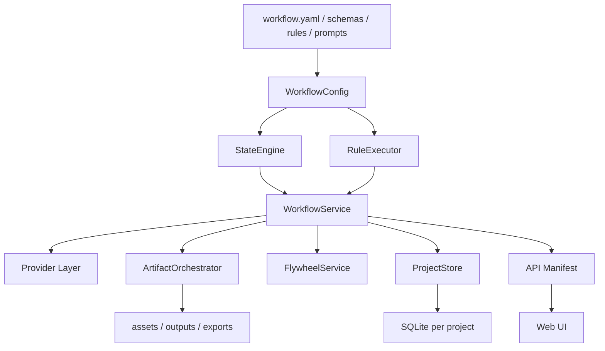

# ShanHaiEdu 架构优化方案 v2

版本：2026-06-22  
角色：首席系统架构师  
适用阶段：v1 内测前架构补强  
目标读者：后端工程师、前端工程师、测试工程师、产品经理、运维/部署工程师

---

## 1. 架构裁决摘要

### 1.1 总裁决

当前 ShanHaiEdu 的架构方向是对的，但运行实现还没有真正承接产品的三条商业生死线：

- C1 用户主导权：每步可编辑、可重做、approve 后才允许下游读取；上游改动必须触发下游重审。
- C2 课件震撼力：PPT 分支必须是运行时主链路，不能只在前端 demo 中展示。
- C3 飞轮：用户 approve、编辑、override、反馈必须沉淀为可复用数据。

现阶段的核心问题不是“要不要重写架构”，而是“设计层已经有正确骨架，运行层没有硬接上”。优化策略是补承重梁，不推翻已有方向。

### 1.2 优先级裁决

v1 内测前的优先顺序如下：

| 优先级 | 工作 | 裁决 |
|---|---|---|
| P0 | PPT 主链路接通 | 第 0 周先做，解决 C2 破功风险 |
| P0 | StateEngine | 第 1-2 周做，解决 C1 用户主导权 |
| P1 | RuleExecutor | 第 3 周做，解决 N2 管理员可改约束 |
| P1 | Flywheel 最小闭环 | 第 4 周做，先攒数据，不急着智能注入 |
| P1 | 安全边界收口 | 第 5 周做，外销前移除前端 token 暴露 |

`final_delivery` 暂不在第 0 周假接入。原因是当前最终门禁还没有完整运行时闭环，过早放入主线会让用户误以为已经达到正式交付标准。第 0 周只承诺“PPT 主链路可内测”，不承诺“精品交付完成”。

### 1.3 当前架构中值得保留的设计

以下方向应保留并继续加固：

- 一节课 = 一个项目目录 + 一个项目 SQLite，适合 v1 内部部署、备份和迁移。
- provider 分层已经开始拆出文本、图片、视频、TTS，方向正确。
- PromptRegistry 的 DB 优先、文件 fallback、active/canary、TTL cache 雏形值得保留。
- 线性 approve 心智符合教研员使用习惯，UI 必须继续保持线性。
- `workflow.yaml`、schemas、rules、prompts 的设计层已经接近产品“宪法”，应升格为运行时真源。

---

## 2. 第一性原理对齐

### 2.1 C1：用户主导权

用户主导权不是一句交互文案，而是一套后端不可绕过的状态与版本机制。

必须满足：

- 所有节点产物可编辑。
- 所有节点产物可 AI 重做。
- 只有 `approved` 或 `skipped` 的节点能被下游读取。
- 用户 approve 前必须经过规则检查。
- 任一上游 current 版本变更后，下游所有已 approved 节点必须降级为 `needs_review`。
- 降级不删除内容，只要求用户重新判断是否仍可用。

这条如果失守，产品会变成“AI 静默替用户做决定”，教研员掌控感会直接崩掉。

### 2.2 C2：课件震撼力

课件震撼力在 v1 内测阶段主要由 PPT 承担。视频可以逐步打磨，但 PPT 主链路不能是假的。

必须满足：

- 后端运行时 manifest 真实包含 PPT 节点。
- 前端真实 API 模式能看到并操作 PPT 节点。
- `ppt_assembly_plan`、`ppt_page_script`、`ppt_visual_asset`、`pptx_artifact` 能生成、编辑、approve。
- `pptx_artifact/generate` 必须产出可下载 PPTX artifact，并写入节点版本。
- PPT 分支必须读取 `visual_contract` 和 `character_dict`，否则视觉一致性和合规基础不完整。

不允许出现“前端 demo 显示 PPT 节点，后端运行时没有 PPT 节点”的口径分裂。

### 2.3 C3：飞轮

飞轮的第一阶段价值不是算法，而是数据。没有数据，后续检索注入和偏好画像都会变成伪智能。

v1 优先做最小闭环：

- approve 时写入 approved sample。
- approved 后又编辑时写入 post-approve edit。
- warning override 时写入 rule override event。
- 交付后和下次打开时写入 feedback。

暂不要求第 4 周就把飞轮样本注入 prompt。等内测积累足够样本后，再做检索注入更稳。

### 2.4 N1/N2/N3 支撑需求

| 编号 | 要求 | 架构落点 |
|---|---|---|
| N1 | UI 呈现线性 9 步，降低教研员认知负担 | 前端只展示线性步骤，底层仍可用 DAG |
| N2 | 教学法负责人可改 prompt、规则、页面类型配额 | `workflow.yaml`、`workflow/rules/*.yaml`、prompts 成为运行时真源 |
| N3 | 完整三件套：教案 + PPT + 中文男声视频 | PPT 和视频都在主 manifest 中，最终由 `final_delivery` 收口 |

---

## 3. 目标架构

### 3.1 总体结构

目标架构不是新增更多外壳，而是把已有运行逻辑收敛到四个核心服务：



核心原则：

- `workflow.yaml` 是流程、依赖、状态、节点清单的运行时真源。
- `ProjectStore` 只负责持久化，不负责业务状态判断。
- `WorkflowService` 负责编排，但不手写状态机和规则细节。
- 前端只消费 API manifest，不再维护另一套真实节点定义。

### 3.2 StateEngine

职责：

- 统一 6 状态：`not_started`、`drafted`、`needs_review`、`approved`、`blocked`、`skipped`。
- 校验状态转换是否合法。
- 在事务中写入状态变化和 transition log。
- 在上游 current 版本变更时执行 cascade invalidate。
- 计算节点是否可生成、可编辑、可 approve、可跳过。

关键行为：

| 触发 | 行为 |
|---|---|
| `ai_generate_done` | 当前节点进入 `needs_review` |
| `user_save_edit` | 写新版本，当前节点进入 `needs_review` |
| `user_approve` | 规则通过后进入 `approved` |
| `user_redo` | 写新版本，当前节点进入 `needs_review` |
| `cascade_invalidate` | 下游 `approved` 节点降级为 `needs_review` |
| `config_change` | 可选分支进入 `skipped` 或从 `skipped` 恢复 |

裁决：不新增 `approved_stale`。  
理由：状态枚举保持简洁，重审来源由 `state_transition_log.trigger = cascade_invalidate` 表达。

### 3.3 RuleExecutor

职责：

- 加载 `workflow/rules/index.yaml` 和 `workflow/rules/*.yaml`。
- 按 `trigger_node + trigger_event` 找到适用规则。
- 先执行 hard_block，再执行 warning 和 info。
- 将规则结果写入 `rule_result_log`。
- 对 hard_block 返回不可 approve 的结构化错误。
- 对 warning 返回可 override 的结构化提示。

优先落地的规则：

| 规则 | 原因 |
|---|---|
| R010 上游必须 approved/skipped | C1 的基础门禁 |
| R001 中文男声硬约束 | N3 视频交付红线 |
| R004 角色字典禁真人 | 未成年人合规红线 |
| R006 数学事实必须可编辑 | PPT 质量和反幻觉红线 |
| R026 学生可见层不得暴露内部信息 | 成品体验红线 |
| R030 PPT 必须有课程视觉资产 | C2 课件震撼力红线 |

### 3.4 FlywheelService

职责：

- 记录用户 approve 的样本。
- 记录 approve 后的编辑 diff 或 edited content snapshot。
- 记录 warning override。
- 记录课件到手反馈和下次使用反馈。
- 后续为 prompt 注入提供检索接口。

v1 最小 API：

| 方法 | 触发 |
|---|---|
| `record_approve(project_id, user_id, node_id, version_id)` | approve 成功后 |
| `record_post_approve_edit(project_id, user_id, node_id, before_version_id, after_version_id)` | approved 节点被编辑后 |
| `record_rule_override(project_id, user_id, node_id, rule_id, reason)` | 用户 override warning 后 |
| `record_feedback(project_id, user_id, payload)` | 用户提交反馈时 |

第 4 周只要求写入，不要求智能注入。

### 3.5 ArtifactOrchestrator

职责：

- 统一管理 PPTX、PDF、MP4、SRT、音频、contact sheet 等二进制产物。
- 将 artifact 写入节点版本 content，而不是只写文件。
- 给下载接口提供稳定 artifact path。
- 为 `final_delivery` 提供统一输入。

优先场景：

- `pptx_artifact/generate` 调用现有 `export_ppt()` 能力。
- 成功后写入 `pptx_artifact` 节点版本，状态为 `needs_review`。
- content 至少包含 `pptx_path`、`slide_count`、`media_count`、`generated_at`、`source_nodes`。

---

## 4. 分阶段实施方案

### 4.1 第 0 周：接通真实 PPT 主链路

目标：让内测用户在真实 API 模式下能走到 PPTX artifact，不再只看到 demo 节点。

后端范围：

- 运行时节点加入：
  - `visual_contract`
  - `character_dict`
  - `ppt_assembly_plan`
  - `ppt_page_script`
  - `ppt_visual_asset`
  - `pptx_artifact`
- `visual_contract` 和 `character_dict` 必须进入运行层，不能只放 PPT 节点。
- `FakeProvider.generate()` 补齐 PPT 节点的 schema 合法 fake 内容。
- `WorkflowService.generate_node()` 对 `pptx_artifact` 增加 artifact 分支，复用现有 PPT 导出。
- 创建项目时 manifest 应初始化 PPT 节点状态。

前端范围：

- 真实 API 节点映射补齐：
  - `visual_contract`
  - `character_dict`
  - `ppt_assembly_plan`
  - `ppt_page_script`
  - `ppt_visual_asset`
  - `pptx_artifact`
- 工作区按后端 manifest 渲染 PPT 节点。
- demo 静态节点与真实 API 节点必须明确隔离，真实模式不得使用 demo 状态。

测试验收：

- 新建项目 manifest 包含上述 PPT 节点。
- 完成 `lesson_plan` approve 后，`ppt_assembly_plan` 可 generate。
- PPT 分支节点可 generate、edit、approve。
- `pptx_artifact/generate` 产出 `pptx_path`，文件存在，可下载。
- 不启用 `final_delivery` 假完成状态。

### 4.2 第 1-2 周：实现 StateEngine

目标：把用户主导权从“约定”升级成“运行时不可绕过的状态机”。

后端范围：

- 新增 `StateEngine`，由 `workflow.yaml` 的 states、transitions、dependencies 驱动。
- 新增 `state_transition_log` 表。
- 所有 generate/edit/approve/redo/skip 必须通过 StateEngine。
- `ProjectStore.approve_node()` 不再直接改状态，应由 StateEngine 编排。
- 实现 cascade invalidate：
  - 任一上游 current version 变化。
  - 找到所有依赖下游。
  - 下游中 `approved` 的节点降级为 `needs_review`。
  - 不删除 content，不清空 current version。

前端范围：

- UI 展示 `needs_review` 时区分普通待确认和“上游变更后需重审”。
- 区分方式来自 transition log 或 API manifest 的 derived reason，不新增业务状态。
- StageStatus 只做展示态映射，不影响后端判断。

测试验收：

- 非 approved/skipped 上游时，下游 generate 被拒。
- 上游 approved 后，下游可 generate。
- 修改已 approved 的上游节点后，下游 approved 节点变 `needs_review`。
- transition log 中记录 `trigger=cascade_invalidate`。
- 回到页面后，下游原内容仍保留。

### 4.3 第 3 周：实现 RuleExecutor

目标：把规则从文档约束升级为运行时门禁。

后端范围：

- 新增 `RuleExecutor`。
- 启动时加载并校验 `workflow/rules/index.yaml` 与规则文件。
- approve 前统一执行 `on_approve_attempt` 规则。
- save/generate/submit 逐步接入对应 trigger。
- hard_block 失败时返回结构化错误码和人类可读提示。
- warning 返回可展示结果，允许用户 override。
- 规则结果写入 `rule_result_log`。

优先规则：

- R010：所有节点 generate 前必须检查上游 passable。
- R001：final_video approve 前检查中文男声。
- R004：character_dict save 前检查禁真人关键词和非写实风格。
- R006：ppt_page_script approve 前检查数学事实 editable layer。
- R026：pptx_artifact approve 前检查学生可见层内部信息。
- R030：pptx_artifact approve 前检查课程视觉资产。

测试验收：

- 破坏 R004 时保存角色字典失败。
- 破坏 R006 时 PPT 页面脚本 approve 失败。
- 破坏 R030 时 PPTX artifact approve 失败。
- warning 可 override，override 写入日志。
- hard_block 不可 override。

### 4.4 第 4 周：实现 Flywheel 最小闭环

目标：让 C3 从“未来想法”变成“今天开始积累数据”。

后端范围：

- 新增飞轮相关表：
  - `approved_samples`
  - `post_approve_edits`
  - `rule_override_events`
  - `feedback_log`
- approve 成功后写 `approved_samples`。
- approved 节点再编辑时写 `post_approve_edits`。
- warning override 时写 `rule_override_events`。
- 用户反馈写 `feedback_log`。

前端范围：

- 不必在第 4 周做完整偏好画像页。
- 需要在交付后或下次打开项目时预留反馈入口。
- 后台或调试接口可查询当前项目飞轮事件，方便测试。

测试验收：

- approve 一个节点后，`approved_samples` 增加记录。
- approved 后编辑同一节点，`post_approve_edits` 增加记录。
- override warning 后，`rule_override_events` 增加记录。
- feedback API 写入 `feedback_log`。
- 不做跨用户检索，不做智能注入。

### 4.5 第 5 周：安全边界收口

目标：为 v1.x 外销准备，消除前端暴露 provider token 的结构性风险。

后端范围：

- provider key 只允许存在于后端环境变量或后端配置。
- 前端请求后端 API，后端再代理到 LLM/image/video/TTS provider。
- 后端对真实 provider 调用做统一脱敏日志。
- `.env.example` 只保留变量名和占位，不放真实值。

前端范围：

- 移除外销路径中的 `NEXT_PUBLIC_API_TOKEN` 依赖。
- 用户态 bundle 不得包含 provider token、admin token 或真实密钥。

测试验收：

- 构建后 grep 前端产物，不出现 provider token 变量值。
- 前端 network 请求只打到自家 API。
- 后端调用 provider 时带密钥，日志脱敏。
- 普通用户无法通过 DevTools 获取 provider key。

---

## 5. 数据模型优化

### 5.1 state_transition_log

用途：记录所有状态变化，为 cascade 重审、异常恢复、审计和飞轮提供事实源。

建议字段：

| 字段 | 类型 | 说明 |
|---|---|---|
| transition_id | text | 唯一 ID |
| project_id | text | 项目 ID |
| node_id | text | 节点 ID |
| from_status | text | 原状态 |
| to_status | text | 新状态 |
| trigger | text | `ai_generate_done/user_save_edit/user_approve/cascade_invalidate` 等 |
| triggered_at | text | ISO 时间 |
| triggered_by_user_id | text nullable | 用户 ID |
| version_id_before | text nullable | 变化前 current version |
| version_id_after | text nullable | 变化后 current version |
| reason | text nullable | 人类可读原因 |

### 5.2 rule_result_log

用途：记录规则执行结果，为 UI 展示、override 和后续规则优化提供数据。

建议字段：

| 字段 | 类型 | 说明 |
|---|---|---|
| result_id | text | 唯一 ID |
| project_id | text | 项目 ID |
| node_id | text | 节点 ID |
| version_id | text nullable | 对应版本 |
| rule_id | text | 规则 ID |
| trigger_event | text | 触发事件 |
| severity | text | hard_block/warning/info |
| passed | integer | 0/1 |
| message | text | 展示给用户的说明 |
| details_json | text | 结构化详情 |
| created_at | text | 时间 |

### 5.3 approved_samples

用途：记录用户真正接受的产物，作为后续飞轮检索样本。

建议字段：

| 字段 | 类型 | 说明 |
|---|---|---|
| sample_id | text | 唯一 ID |
| user_id | text | 用户 ID |
| project_id | text | 项目 ID |
| node_id | text | 节点 ID |
| version_id | text | 被 approve 的版本 |
| content_excerpt | text | 可检索摘要 |
| content_json | text | 可选完整结构 |
| approved_at | text | approve 时间 |

### 5.4 post_approve_edits

用途：记录用户在 approve 后仍然修改的内容，这是偏好信号中价值最高的一类。

建议字段：

| 字段 | 类型 | 说明 |
|---|---|---|
| edit_id | text | 唯一 ID |
| user_id | text | 用户 ID |
| project_id | text | 项目 ID |
| node_id | text | 节点 ID |
| before_version_id | text | 编辑前版本 |
| after_version_id | text | 编辑后版本 |
| diff_json | text nullable | 结构化 diff |
| edited_at | text | 编辑时间 |

### 5.5 rule_override_events

用途：记录用户经常 override 哪些 warning，后续可转化为偏好。

建议字段：

| 字段 | 类型 | 说明 |
|---|---|---|
| override_id | text | 唯一 ID |
| user_id | text | 用户 ID |
| project_id | text | 项目 ID |
| node_id | text | 节点 ID |
| rule_id | text | 被 override 的规则 |
| reason | text nullable | 用户原因 |
| created_at | text | 时间 |

### 5.6 feedback_log

用途：记录课件到手反馈和上完课反馈。

建议字段：

| 字段 | 类型 | 说明 |
|---|---|---|
| feedback_id | text | 唯一 ID |
| user_id | text | 用户 ID |
| project_id | text | 项目 ID |
| feedback_type | text | delivery/next_session/classroom_after_use |
| payload_json | text | 反馈内容 |
| created_at | text | 时间 |

### 5.7 保留 SQLite per project

本轮不引入多租户 SaaS 数据库，不做 Postgres 迁移。

理由：

- v1 内测以本地和内网部署为主。
- 一节课一个项目目录，备份、迁移、打包都简单。
- 架构问题主要在状态、规则、飞轮和运行配置，不在数据库选型。

---

## 6. 前后端契约

### 6.1 后端 manifest 是唯一状态源

前端不得根据本地静态 workflow 推断真实项目状态。

后端 manifest 至少提供：

- 节点 ID、标题、step、branch。
- 当前 status。
- 上游依赖和 passable 状态。
- 当前版本 ID。
- 是否可 generate/edit/approve/redo/skip。
- 最近一次状态变化原因。
- hard_block/warning 摘要。
- artifact 下载信息。

### 6.2 前端 StageStatus 只做展示态映射

前端可以保留更细的展示态，例如：

- `input_required`
- `ready`
- `running`
- `pending_confirm`
- `failed`

但这些状态不能回写为业务状态，也不能替代后端 6 状态。

建议映射：

| 后端状态 | 前端展示态 |
|---|---|
| `not_started` | `not_started` 或 `ready` |
| `drafted` | `running` 或 `pending_confirm` |
| `needs_review` | `pending_confirm` |
| `approved` | `approved` |
| `blocked` | `blocked` |
| `skipped` | `approved` 或 `skipped` 展示标签 |

### 6.3 demo workflow 与真实 workflow 分离

允许保留 demo workflow，但必须满足：

- 真实 API 模式只渲染后端 manifest。
- demo 节点不能混入真实项目。
- 如果保留静态 demo 节点，文件名、变量名和 UI 标记必须明确为 demo。
- 更优方案是由后端 manifest mock 生成 demo 数据，避免两套节点定义漂移。

### 6.4 节点口径统一

第 0 周完成后，真实 API 主链路至少应包含：

| 节点 | 是否进入运行层 | 原因 |
|---|---|---|
| `project_meta` | 是 | 项目基础 |
| `project_config` | 是 | 分支配置 |
| `visual_contract` | 是 | PPT/视频视觉一致性 |
| `character_dict` | 是 | 角色一致性和合规 |
| `lesson_plan` | 是 | 教案主线 |
| `intro_selection` | 是 | 导入视频选择 |
| `ppt_assembly_plan` | 是 | PPT 分支入口 |
| `ppt_page_script` | 是 | PPT 内容主骨架 |
| `ppt_visual_asset` | 是 | PPT 震撼力基础 |
| `pptx_artifact` | 是 | PPTX 真实产物 |
| `intro_video_script` | 是 | 视频文稿 |
| `intro_video_screenplay` | 是 | 视频剧本 |
| `intro_video_asset` | 是 | 视频资产 |
| `storyboard` | 是 | 视频分镜 |
| `final_video` | 是 | 中文男声视频 |
| `final_delivery` | 暂不进入第 0 周 | 等最终门禁真实接通 |

---

## 7. 验收方案

### 7.1 第 0 周 PPT 主链路验收

必须通过：

- 新项目 manifest 包含 `visual_contract`、`character_dict`、`ppt_assembly_plan`、`ppt_page_script`、`ppt_visual_asset`、`pptx_artifact`。
- `lesson_plan` approve 后，`ppt_assembly_plan` 可生成。
- `ppt_assembly_plan` approve 后，`ppt_page_script` 可生成。
- `ppt_page_script` approve 后，`ppt_visual_asset` 可生成。
- `ppt_visual_asset` approve 后，`pptx_artifact` 可生成。
- `pptx_artifact` 节点版本包含 `pptx_path`。
- `pptx_path` 对应文件存在且可下载。

### 7.2 StateEngine 验收

必须通过：

- 非 approved/skipped 上游阻止下游 generate。
- approved 上游允许下游 generate。
- 用户 edit 已 approved 上游后，下游 approved 节点自动变 `needs_review`。
- cascade 后下游内容仍保留。
- `state_transition_log` 写入完整记录。
- 不出现 `approved_stale` 第七业务状态。

### 7.3 RuleExecutor 验收

必须通过：

- approve 必须经过 RuleExecutor。
- hard_block 命中时 approve 失败。
- warning 命中时 UI 可提示，并允许 override。
- override 写入 `rule_override_events`。
- 至少 R010、R001、R004、R006、R026、R030 有自动化测试。

### 7.4 Flywheel 验收

必须通过：

- approve 写 `approved_samples`。
- approved 后 edit 写 `post_approve_edits`。
- warning override 写 `rule_override_events`。
- feedback API 写 `feedback_log`。
- 不做跨用户检索。
- 不要求 prompt 注入生效。

### 7.5 安全边界验收

必须通过：

- 外销模式前端 bundle 不包含 provider token。
- 前端不直接请求第三方 LLM/image/video/TTS provider。
- provider token 只在后端环境中使用。
- 后端日志不打印密钥。
- `.env.example` 不含真实值。

### 7.6 真实链路验收

最终 v1 内测前至少跑通：

```text
教材解析
  -> 公开课教案
  -> PPT 总装方案
  -> PPT 页面脚本
  -> PPT 视觉资产
  -> PPTX artifact
```

视频链路可以继续受真实 provider 额度影响，但不能影响 PPT 主链路内测。

---

## 8. 风险与取舍

### 8.1 PPT 主链路先接通的风险

风险：第 0 周接通的 PPT 主链路可能绕过部分精品门禁。

取舍：接受，但必须在 UI 和文档中明确这是“内测可运行主链路”，不是“正式精品交付完成”。正式交付仍要等 `final_delivery` 和相关门禁接通。

### 8.2 visual_contract 和 character_dict 必须进入运行层

只接 PPT 节点但不接 `visual_contract` 和 `character_dict`，会造成设计层依赖不完整。

裁决：第 0 周一并纳入运行时。它们可以先是表单型或 fake 默认产物，但必须真实存在于 manifest 和依赖图中。

### 8.3 final_delivery 暂不硬接

风险：用户暂时不能看到完整第 9 步最终交付。

取舍：优先避免“假完成”。第 0 周产出 PPTX artifact 即可，`final_delivery` 等门禁脚本、PPTX、视频、反馈、学生可见层审计全部接通后再进入主线。

### 8.4 飞轮先攒数据，不急着智能注入

风险：短期用户感知不到“越用越懂我”。

取舍：先保证数据真实，避免样本不足时做伪智能。内测累计 50 个以上 approved samples 后，再做同节点、同用户、同学科的检索注入。

### 8.5 安全债分阶段处理

内网演示阶段 `NEXT_PUBLIC_API_TOKEN` 风险可接受，但外销前必须清掉。

裁决：第 5 周纳入 v1.x 外销前置门槛。若要给外部客户演示，必须提前完成后端代理模式。

---

## 9. 任务拆分建议

### 9.1 后端任务

| 任务 | 交付物 |
|---|---|
| 接通 PPT runtime nodes | manifest 和 generate/edit/approve 支持 PPT 节点 |
| `pptx_artifact/generate` | 写入 PPTX 节点版本并提供下载 |
| StateEngine | 6 状态、transition log、cascade invalidate |
| RuleExecutor | rules YAML 加载、hard_block/warning 执行、rule log |
| FlywheelService | approve/edit/override/feedback 事件落库 |
| 安全代理 | provider token 后端持有、日志脱敏 |

### 9.2 前端任务

| 任务 | 交付物 |
|---|---|
| 真实 API 节点映射补齐 | PPT 节点在真实工作区可见 |
| manifest 驱动渲染 | 真实 API 模式不再使用 demo 节点状态 |
| cascade 重审提示 | 上游变更后展示下游需重审原因 |
| 规则结果展示 | hard_block/warning/override UI |
| 反馈入口 | 写入 feedback API 的入口 |
| token 安全调整 | 前端不依赖 provider token |

### 9.3 测试任务

| 任务 | 交付物 |
|---|---|
| PPT 主链路契约测试 | 新项目到 PPTX artifact 全链路 |
| 状态机回归 | edit/redo/approve/cascade/skipped |
| 规则门禁回归 | R010/R001/R004/R006/R026/R030 |
| 飞轮落库回归 | approve/edit/override/feedback |
| 安全扫描 | 前端 bundle 无 provider token |
| 浏览器验收 | 真实 API 模式线性 9 步工作区 |

---

## 10. 决策边界

本轮明确不做：

- 不重写整个项目。
- 不引入 plugin SDK。
- 不做多人协作、评论、节点锁。
- 不做 Postgres/SaaS 多租户迁移。
- 不做 diff 预览和智能影响分析。
- 不做飞轮智能注入。
- 不把 `final_delivery` 假装接通。

本轮必须做：

- PPT 主链路进入真实运行层。
- 状态机成为不可绕过的后端机制。
- 规则执行从文档进入运行时。
- 飞轮开始记录真实数据。
- 前后端节点口径统一。
- 外销前清除前端 token 暴露。

---

## 11. 最终裁决

ShanHaiEdu 不需要推翻重做。它现在最需要的是把已经写在设计层里的正确架构，补成运行层的硬机制。

最小正确路线是：

```text
第 0 周：PPT 主链路真实接通，保住 C2
第 1-2 周：StateEngine + cascade invalidate，保住 C1
第 3 周：RuleExecutor，兑现 N2
第 4 周：Flywheel 最小落库，启动 C3
第 5 周：安全边界收口，准备 v1.x 外销
```

这条路线不追求炫技，也不做大而全平台化。它只服务一个目标：让教研员在网页上，按线性步骤，真正产出“教案 + PPT + 中文男声视频”三件套，并且每一步都由用户掌控，越用越懂用户。
